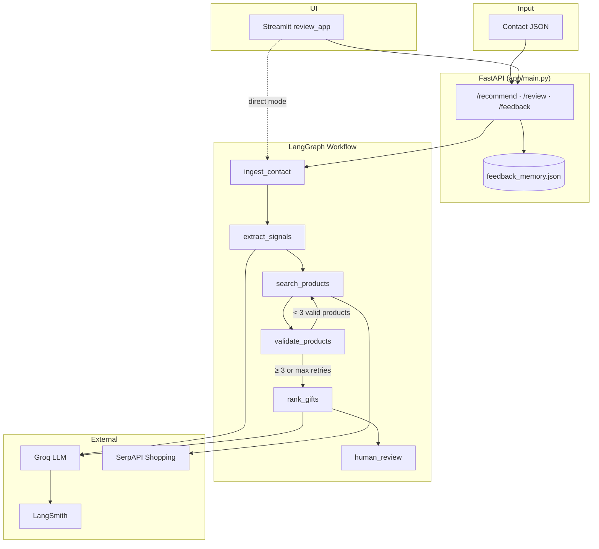
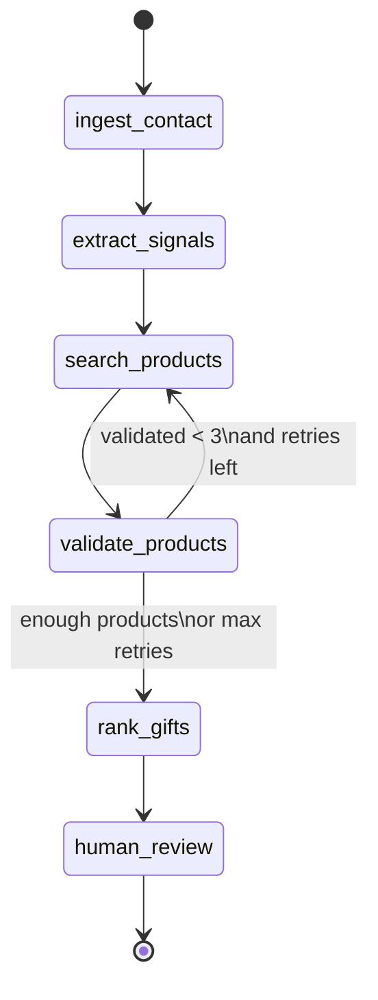
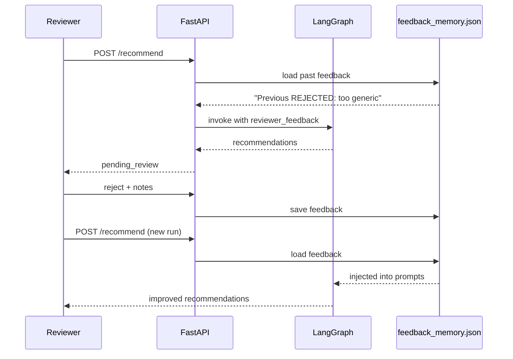

# DelightLoop — Hyper-Personalised Gift Recommendation Agent

AI-powered, multi-step gift recommendation workflow for B2B contacts. Built for the **DelightLoop Founding AI Engineer** assignment.

Takes enriched LinkedIn-style contact data → extracts safe gifting signals → searches real products on the web → validates budget and appropriateness → ranks top 3 gifts with personalised messages → supports human review with a learning feedback loop.

---

## Table of Contents

1. [Quick Start](#quick-start)
2. [Environment Variables](#environment-variables)
3. [Project Structure](#project-structure)
4. [Architecture Overview](#architecture-overview)
5. [Workflow Deep Dive](#workflow-deep-dive)
6. [API Reference](#api-reference)
7. [Streamlit UI](#streamlit-ui)
8. [Human Review & Learning Loop](#human-review--learning-loop)
9. [Observability (LangSmith)](#observability-langsmith)
10. [Quality & Evaluation](#quality--evaluation)
11. [Testing](#testing)
12. [Deployment](#deployment)
    - [GitHub](#github)
    - [Hugging Face Spaces](#hugging-face-spaces)
13. [Tradeoffs & Future Improvements](#tradeoffs--future-improvements)
14. [Assignment Checklist](#assignment-checklist)

---

## Quick Start

### Prerequisites

- **Python 3.10+**
- Free API keys:
  - [Groq](https://console.groq.com) — LLM (`llama-3.3-70b-versatile`)
  - [SerpAPI](https://serpapi.com) — Google Shopping product search
  - [LangSmith](https://smith.langchain.com) — optional tracing

### 1. Clone and install

```bash
git clone https://github.com/YOUR_USERNAME/delightloop-gift-agent.git
cd delightloop-gift-agent

python -m venv venv

# Windows
venv\Scripts\activate

# macOS / Linux
source venv/bin/activate

pip install -r requirements.txt
```

### 2. Configure environment

```bash
cp .env.example .env
# Edit .env and add your API keys — never commit .env
```

### 3. Run the API (Terminal 1)

```bash
uvicorn app.main:app --reload --host 127.0.0.1 --port 8000
```

Open API docs: http://127.0.0.1:8000/docs

### 4. Run the UI (Terminal 2)

```bash
# HTTP mode — talks to FastAPI
set API_URL=http://127.0.0.1:8000
set GIFT_AGENT_DIRECT=false
streamlit run ui/review_app.py

# Or direct mode — no API needed
set GIFT_AGENT_DIRECT=true
streamlit run ui/review_app.py
```

Open UI: http://localhost:8501

### 5. Run a recommendation (curl)

**Important:** `/recommend` expects a **single contact object**, not an array.

```bash
curl -X POST http://127.0.0.1:8000/recommend \
  -H "Content-Type: application/json" \
  -d @sample_input/contact_single.json
```

Bulk (array of contacts):

```bash
curl -X POST http://127.0.0.1:8000/recommend/bulk \
  -H "Content-Type: application/json" \
  -d @sample_input/contacts.json
```

Full workflow script:

```bash
python test_schema.py
```

---

## Environment Variables

| Variable | Required | Description |
|----------|----------|-------------|
| `GROQ_API_KEY` | **Yes** | Groq API key for LLM calls |
| `SERPAPI_KEY` | **Yes** | SerpAPI key for Google Shopping search |
| `LANGCHAIN_API_KEY` | No | Enables LangSmith tracing |
| `LANGCHAIN_TRACING_V2` | No | Set `true` to record traces |
| `LANGCHAIN_PROJECT` | No | LangSmith project name (default: `delightloop-gift-agent`) |
| `API_URL` | No | FastAPI base URL for Streamlit UI (default: `http://127.0.0.1:8000`) |
| `GIFT_AGENT_DIRECT` | No | `true` = UI calls workflow in-process; `false` = HTTP to API |

Copy `.env.example` → `.env` locally. On **Hugging Face**, add the same keys as **Space Secrets** (never hardcode in code).

---

## Project Structure

```
delightloop-gift-agent/
├── app/
│   ├── main.py                 # FastAPI app, review endpoints, workflow invocation
│   ├── schemas/
│   │   └── models.py           # Pydantic input/output schemas
│   ├── services/
│   │   ├── llm.py              # Groq LLM + LangSmith auto-tracing
│   │   ├── search.py           # SerpAPI search + query generation
│   │   ├── feedback_memory.py  # Persistent human feedback (learning loop)
│   │   └── tracing.py          # LangSmith run metadata + human scores
│   ├── utils/
│   │   └── validators.py       # Price, URL, appropriateness checks
│   └── workflow/
│       ├── graph.py            # LangGraph definition + conditional retry
│       ├── state.py            # GraphState TypedDict
│       └── nodes/
│           ├── ingest.py       # Step 1: contact ingestion
│           ├── signals.py      # Step 2: LLM signal extraction
│           ├── search.py       # Step 3: product search
│           ├── validate.py     # Step 4: deterministic validation
│           ├── rank.py         # Step 5: LLM ranking + messages
│           └── review.py       # Step 6: human review gate
├── ui/
│   ├── review_app.py           # Streamlit human-review interface
│   └── client.py               # API or direct-mode client
├── streamlit_app.py            # Hugging Face Space entry point
├── tests/
│   └── test_feedback_memory.py
├── sample_input/
│   ├── contact_single.json     # Single contact for /recommend
│   └── contacts.json           # Array for /recommend/bulk
├── sample_output/
│   └── aarav_mehta.json        # Example successful output
├── data/                       # Runtime feedback memory (gitignored)
├── Dockerfile                  # Hugging Face Docker Space (API)
├── requirements.txt
├── requirements-dev.txt
├── .env.example                # Template — safe to commit
└── README.md
```

---

## Architecture Overview

### Design principles

1. **Separate AI reasoning from deterministic logic** — LLM extracts signals and ranks; Python validates prices and URLs.
2. **Stateful workflow** — LangGraph manages step order, retries, and state.
3. **Human-in-the-loop** — Recommendations are not final until reviewed; feedback improves future runs.
4. **Grounded products** — Gifts come from SerpAPI search results, not LLM invention.
5. **Observable** — LangSmith traces every LLM call when configured.

### High-level system diagram



### AI vs deterministic boundaries

| Step | Type | Why |
|------|------|-----|
| Signal extraction | **LLM** | Unstructured LinkedIn text → structured signals |
| Query generation | **Deterministic** | Reliable budget/signal → search query mapping |
| Product search | **Tool (SerpAPI)** | Real purchasable products |
| Validation | **Deterministic** | Hard rules on price, URL, appropriateness |
| Ranking + messages | **LLM** | Judgment + natural language generation |
| Human review | **Human + API** | Trust gate before finalisation |
| Feedback memory | **Deterministic** | Persist and inject past reviewer notes |

---

## Workflow Deep Dive

### LangGraph flow



### Step-by-step

#### Step 1 — Ingest contact
- Validates contact is present in workflow state.
- No external calls.

#### Step 2 — Extract signals (LLM)
- Reads LinkedIn profile: headline, about, posts, comments, topics, experience.
- Outputs JSON:
  - `strong_signals` — clear interests (e.g. cricket, SaaS GTM)
  - `weak_signals` — uncertain inferences
  - `signals_to_avoid` — guardrails (no religion, politics, health, etc.)
- **Injected context:** past reviewer feedback from `feedback_memory.json`.

#### Step 3 — Search products (SerpAPI)
- Generates up to 4 queries from signals + budget (e.g. `premium cricket gift hamper India 3000 to 5000 INR`).
- Calls Google Shopping via SerpAPI (`gl=in` for India).
- Builds fallback Amazon/Flipkart search URLs when direct product links are missing.
- **Retry mode:** broader/alternate queries; merges and deduplicates products.

#### Step 4 — Validate products (deterministic)
Hard filters:
- **Price:** must be within 95% of `budget_min` → `budget_max`
- **Appropriateness:** blocks alcohol, religious, adult, medical keywords
- **URL:** soft check (fallback URLs kept even if HEAD request fails)

If **< 3 products** pass → increment retry counter → loop back to search (max 2 retries).

#### Step 5 — Rank gifts (LLM)
- Ranks top 3 distinct in-budget products.
- **Budget rule:** out-of-budget products capped at confidence ≤ 0.3.
- **Message rules:** no generic "Dear X, I wanted to thank you"; must reference specific profile signals.
- **Reasoning rules:** cite actual signals, not meta-commentary.
- JSON parse retry + deterministic fallback ranking if LLM output fails.

#### Step 6 — Human review
- Sets status `pending_review`.
- Available actions: `approve`, `reject`, `edit`, `regenerate`.

### GraphState schema

```python
{
    "contact": dict,
    "profile_signals": dict,
    "search_trace": dict,       # queries_used, products_considered_count, search_retries
    "raw_products": list,
    "validated_products": list,
    "recommended_gifts": list,
    "human_review": dict,
    "errors": list,
    "current_step": str,
    "search_retry_count": int,
    "reviewer_feedback": str,   # historical + session notes for LLM
}
```

---

## API Reference

### `GET /`
Health check.

### `POST /recommend`
Run full workflow for one contact. Loads historical feedback automatically.

**Body:** single contact object (see `sample_input/contact_single.json`).

**Response:**
```json
{
  "run_id": "uuid",
  "contact_name": "Aarav Mehta",
  "profile_signals": { ... },
  "search_trace": { ... },
  "recommended_gifts": [ ... ],
  "human_review": { "status": "pending_review", ... },
  "learning_context": {
    "historical_feedback_applied": true,
    "feedback_entries_count": 2,
    "last_action": "reject",
    "last_notes": "Too generic"
  },
  "errors": []
}
```

### `POST /recommend/bulk`
Array of contacts. Returns one result per contact.

### `POST /review/{run_id}?action=approve|reject|edit|regenerate&notes=...`
Human review action. Persists feedback to `data/feedback_memory.json`.

| Action | Effect |
|--------|--------|
| `approve` | Marks approved; saves feedback; scores LangSmith trace +1 |
| `reject` | Marks rejected; saves feedback; scores LangSmith trace 0 |
| `edit` | Saves reviewer notes only |
| `regenerate` | Re-runs workflow with notes injected into prompts |

### `GET /feedback?name=Aarav Mehta&company=Acme Corp`
Inspect persisted feedback history for a contact.

### `GET /results/{run_id}` · `GET /results`
Fetch stored run(s) from in-memory store (resets on server restart).

---

## Streamlit UI

Features:
- Load sample contact or paste JSON
- View profile signals, search trace, top 3 gifts
- Learning memory banner when past feedback applies
- Approve / Reject / Regenerate / Save notes
- Raw JSON viewer

**Modes** (via `ui/client.py`):

| Mode | When | Use case |
|------|------|----------|
| **HTTP** | `GIFT_AGENT_DIRECT=false`, `API_URL` set | Local dev with separate API |
| **Direct** | `GIFT_AGENT_DIRECT=true` or no `API_URL` | Hugging Face Space, single-process demo |

---

## Human Review & Learning Loop



**What improves over time:** reviewer notes from approve/reject/regenerate are saved per contact (name + company) and injected into signal extraction and ranking prompts on every future run.

**What does not auto-improve:** LangSmith traces alone — they record runs for debugging, not learning.

---

## Observability (LangSmith)

When `LANGCHAIN_API_KEY` is set:

- Every LLM call (signals, ranking) is traced automatically
- Each workflow run uses API `run_id` as LangSmith trace ID
- Approve → feedback score `1.0`; Reject → score `0.0`

View traces: https://smith.langchain.com → project `delightloop-gift-agent`

---

## Quality & Evaluation

### How I would measure quality

| Dimension | Method | Pass criteria |
|-----------|--------|---------------|
| **Gift relevance** | Manual rubric: does gift match strong signals? | ≥ 2/3 gifts clearly tied to profile |
| **Budget fit** | Automated: `is_price_in_budget` | 100% of ranked gifts in range |
| **Link validity** | HTTP HEAD on product URLs | No hallucinated URLs |
| **Message quality** | Rubric: specific vs generic opener | No banned templates; cites ≥ 1 signal |
| **Professional tone** | Manual review | Appropriate for relationship type |
| **Guardrails** | Adversarial profiles | No sensitive-attribute inference |
| **Failure handling** | Empty/poor search mock | Retry fires; confidence lowered |

### Regression approach

1. Golden set: `sample_input/contacts.json` + expected signal keywords
2. `pytest tests/` for feedback memory
3. LangSmith dataset: store approved runs as positive examples
4. Track: approval rate, rejection rate, regeneration rate over time

See also: `docs/EVALUATION.md`

---

## Testing

```bash
# Full workflow (requires API keys, ~60–90s)
python test_schema.py

# Unit tests (no API keys)
pip install -r requirements-dev.txt
pytest tests/ -q
```

---

## Deployment

### GitHub

**Never commit `.env`.** Only commit `.env.example`.

```bash
# One-time: configure git identity (if not set globally)
git config user.email "you@example.com"
git config user.name "Your Name"

git add .
git status   # verify .env is NOT listed
git commit -m "DelightLoop gift agent: LangGraph workflow, review UI, learning loop"
git branch -M main
git remote add origin https://github.com/YOUR_USERNAME/delightloop-gift-agent.git
git push -u origin main
```

Create repo on GitHub first: https://github.com/new → name `delightloop-gift-agent` → **do not** add README (you already have one).

### Hugging Face Spaces

Two deployment options:

#### Option A — Streamlit Space (recommended for demo)

Single app with UI + in-process workflow. No separate API.

1. Create Space: https://huggingface.co/new-space
   - SDK: **Streamlit**
   - Hardware: **CPU basic** (free)
2. Push this repo or connect GitHub
3. Set **Space Secrets** (Settings → Secrets):

   | Secret | Value |
   |--------|-------|
   | `GROQ_API_KEY` | your key |
   | `SERPAPI_KEY` | your key |
   | `LANGCHAIN_API_KEY` | optional |
   | `LANGCHAIN_TRACING_V2` | `true` |
   | `LANGCHAIN_PROJECT` | `delightloop-gift-agent` |

4. Ensure `app_file` in README frontmatter points to `streamlit_app.py`  
   (copy YAML header from `README_HF_SPACE.md` into Space README if needed)

5. Space runs `streamlit_app.py` → direct mode → full workflow in one container

#### Option B — Docker Space (API only)

For REST API / curl demos:

1. Create Space with SDK: **Docker**
2. Uses root `Dockerfile` — exposes port **7860**
3. Add same secrets as above
4. Test: `curl https://YOUR-SPACE.hf.space/recommend -d @sample_input/contact_single.json`

Pair with local Streamlit:
```bash
set API_URL=https://YOUR-SPACE.hf.space
set GIFT_AGENT_DIRECT=false
streamlit run ui/review_app.py
```

### Environment security checklist

- [ ] `.env` in `.gitignore`
- [ ] `.env.example` has placeholders only
- [ ] HF secrets set in Space settings, not in code
- [ ] Rotate keys if ever committed accidentally

---

## Tradeoffs & Future Improvements

### Tradeoffs made

| Decision | Why | Cost |
|----------|-----|------|
| Groq free tier | Fast, free for assignment | Rate limits; occasional JSON parse failures |
| SerpAPI Google Shopping | Real product links | Search quality varies; many cheap results |
| In-memory `results_store` | Simple for prototype | Lost on restart; not multi-user |
| JSON feedback file | No database setup | Not suitable for production scale |
| 95% budget floor | Filters sub-budget junk | May reject valid sale items slightly below min |

### Future improvements

- Postgres for runs + feedback (multi-tenant, durable)
- Pydantic request validation on `/recommend`
- UI bulk upload + inline gift editing
- Message tone selector (formal / warm / casual)
- LangSmith eval dataset + CI regression
- Cached search results to reduce SerpAPI cost
- Direct product page URLs (scrape Amazon/Flipkart when SerpAPI returns search links)

---

## Assignment Checklist

| Requirement | Status |
|-------------|--------|
| Multi-step LangGraph workflow | ✅ |
| Signal extraction + guardrails | ✅ |
| Real web product search | ✅ SerpAPI |
| Product validation | ✅ price, URL, appropriateness |
| Top 3 ranking + messages | ✅ |
| Human review (approve/reject/edit/regenerate) | ✅ |
| Intermediate outputs visible | ✅ API + UI |
| Multiple contacts | ✅ bulk endpoint |
| FastAPI backend | ✅ |
| Streamlit UI | ✅ |
| Retry on poor search | ✅ conditional edge |
| LangSmith tracing | ✅ optional |
| Learning from feedback | ✅ feedback_memory |
| README + setup | ✅ this file |
| Sample input/output | ✅ `sample_input/`, `sample_output/` |
| Architecture note | ✅ above + `docs/ARCHITECTURE.md` |
| Eval note | ✅ above + `docs/EVALUATION.md` |

---

## License

MIT — assignment submission for DelightLoop.

---

## Author

Built as part of the DelightLoop **Founding AI Engineer** hiring assignment.
