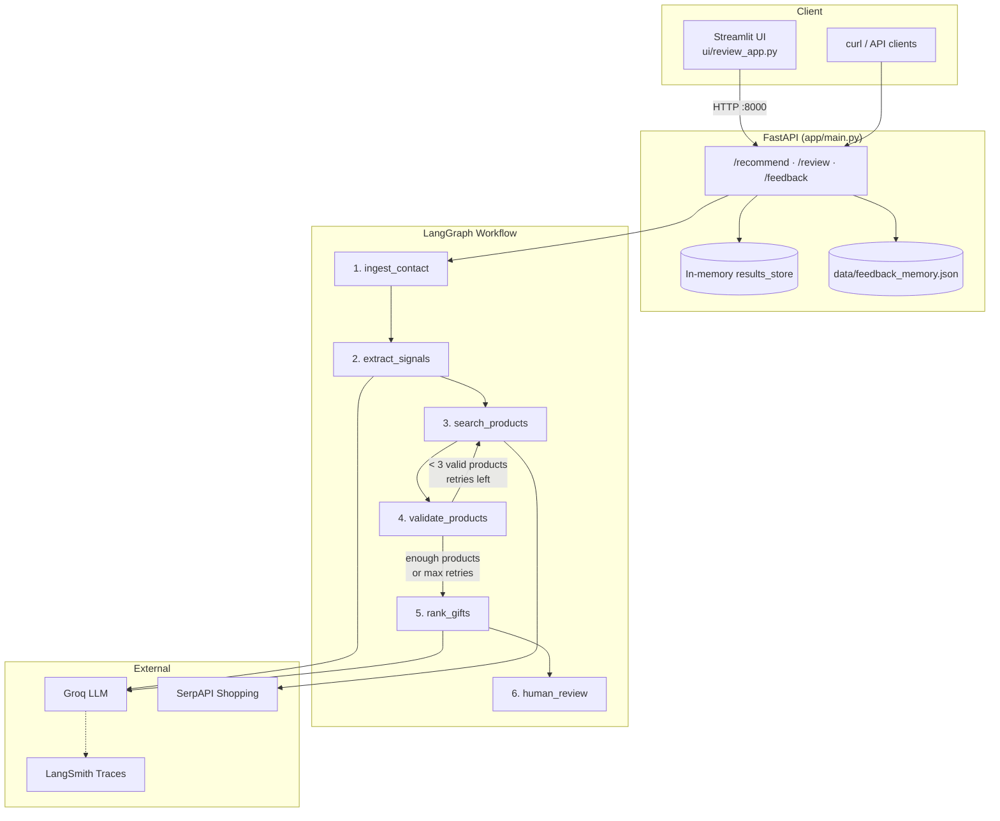
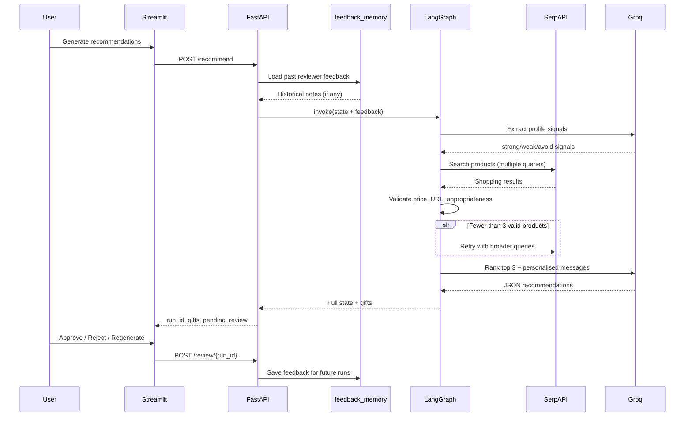
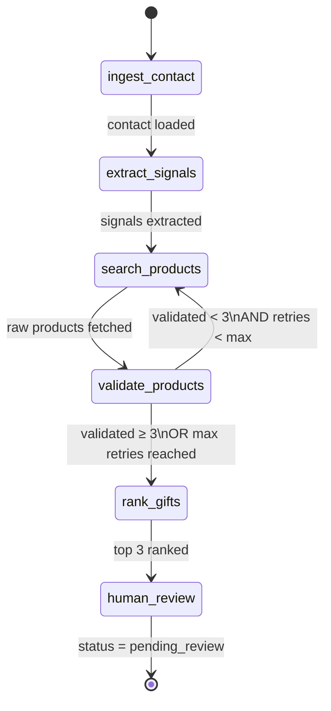
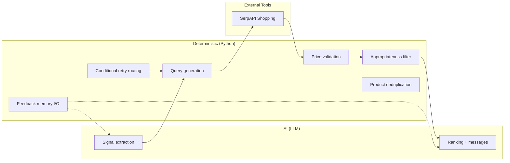
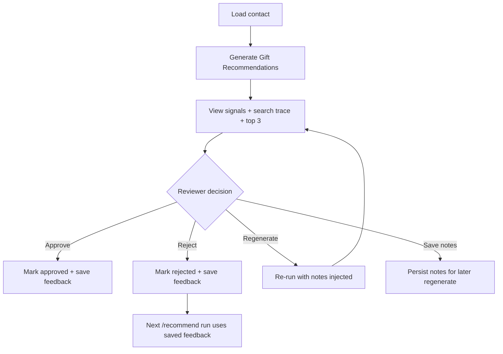
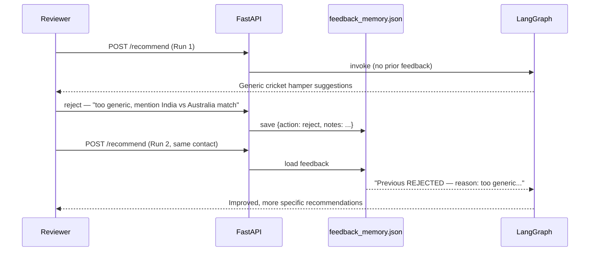

# DelightLoop — Hyper-Personalised Gift Recommendation Agent

> **Assignment submission** for the DelightLoop Founding AI Engineer role.  
> An AI workflow that turns enriched professional contact data into **reviewable, grounded, personalised gift recommendations** with real product links.

---

## Table of Contents

1. [Problem Statement](#problem-statement)
2. [What This Project Does](#what-this-project-does)
3. [Quick Start](#quick-start)
4. [Environment Variables](#environment-variables)
5. [Project Structure](#project-structure)
6. [Architecture Overview](#architecture-overview)
7. [Workflow Deep Dive (LangGraph)](#workflow-deep-dive-langgraph)
8. [AI vs Deterministic Logic](#ai-vs-deterministic-logic)
9. [API Reference](#api-reference)
10. [Streamlit Review UI](#streamlit-review-ui)
11. [Human Review & Learning Loop](#human-review--learning-loop)
12. [Observability (LangSmith)](#observability-langsmith)
13. [Quality & Evaluation](#quality--evaluation)
14. [Testing](#testing)
15. [Sample Input & Output](#sample-input--output)
16. [Push to GitHub](#push-to-github)
17. [Deploy on Hugging Face (Future)](#deploy-on-hugging-face-future)
18. [Tradeoffs & Future Improvements](#tradeoffs--future-improvements)
19. [Assignment Checklist](#assignment-checklist)

---

## Problem Statement

DelightLoop needs an AI system — not a chatbot demo — that:

1. Reads LinkedIn-style professional profiles (posts, comments, topics, experience)
2. Extracts **safe, gift-relevant signals** without inferring sensitive attributes
3. Searches the **real web** for purchasable products within budget and country
4. Ranks the **top 3 gifts** with reasoning and a personalised note
5. Pauses for **human review** (approve / reject / edit / regenerate)
6. Can **learn from reviewer feedback** over time

This repository implements that as a **stateful LangGraph workflow** behind a FastAPI backend, with a Streamlit UI for human review.

---

## What This Project Does

| Capability | Implementation |
|------------|----------------|
| Multi-step workflow | LangGraph with 6 nodes + conditional search retry |
| Signal extraction | Groq LLM (`llama-3.3-70b-versatile`) |
| Product search | SerpAPI Google Shopping (India) |
| Validation | Python: budget, appropriateness, URL checks |
| Ranking + messages | Groq LLM with strict prompt rules |
| Human review | FastAPI `/review` + Streamlit UI |
| Learning loop | `data/feedback_memory.json` persists reviewer notes per contact |
| Tracing | LangSmith (optional, via env vars) |
| Bulk contacts | `POST /recommend/bulk` |

---

## Quick Start

### Prerequisites

- **Python 3.10+**
- Free API keys:
  - [Groq](https://console.groq.com) — LLM
  - [SerpAPI](https://serpapi.com) — product search
  - [LangSmith](https://smith.langchain.com) — optional tracing

### 1. Clone and install

```bash
git clone https://github.com/YOUR_USERNAME/delightloop-gift-agent.git
cd delightloop-gift-agent

python -m venv venv

# Windows (PowerShell / CMD)
venv\Scripts\activate

# macOS / Linux
source venv/bin/activate

pip install -r requirements.txt
```

### 2. Configure environment

```bash
copy .env.example .env        # Windows
# cp .env.example .env        # macOS / Linux
```

Edit `.env` and add your keys. **Never commit `.env` to Git.**

### 3. Start the API (Terminal 1)

Run from the **project root** (`delightloop-gift-agent/`):

```bash
uvicorn app.main:app --reload --host 127.0.0.1 --port 8000
```

Verify:

- Health: http://127.0.0.1:8000/
- Swagger docs: http://127.0.0.1:8000/docs

### 4. Start the UI (Terminal 2)

Also from the **project root**:

```bash
streamlit run ui/review_app.py
```

Open: http://localhost:8501

The UI calls the API at `http://127.0.0.1:8000`. **Both must be running.**

### 5. Run via curl

`/recommend` expects a **single contact object** (not an array):

```bash
curl -X POST http://127.0.0.1:8000/recommend ^
  -H "Content-Type: application/json" ^
  -d @sample_input/contact_single.json
```

Bulk (array of contacts):

```bash
curl -X POST http://127.0.0.1:8000/recommend/bulk ^
  -H "Content-Type: application/json" ^
  -d @sample_input/contacts.json
```

Full end-to-end script (~60–90 seconds, uses API keys):

```bash
python test_schema.py
```

---

## Environment Variables

| Variable | Required | Description |
|----------|----------|-------------|
| `GROQ_API_KEY` | **Yes** | Groq API key for LLM (signal extraction + ranking) |
| `SERPAPI_KEY` | **Yes** | SerpAPI key for Google Shopping search |
| `LANGCHAIN_API_KEY` | No | LangSmith API key — enables trace upload |
| `LANGCHAIN_TRACING_V2` | No | Set to `true` to record LLM traces |
| `LANGCHAIN_PROJECT` | No | LangSmith project name (default: `delightloop-gift-agent`) |

See `.env.example` for a copy-paste template.

### Security rules

- `.env` is listed in `.gitignore` — **never commit it**
- Only commit `.env.example` with placeholder values
- Rotate keys immediately if accidentally pushed

---

## Project Structure

```
delightloop-gift-agent/
│
├── app/                          # Backend application
│   ├── main.py                   # FastAPI routes, workflow orchestration
│   ├── schemas/
│   │   └── models.py             # Pydantic input/output schemas
│   ├── services/
│   │   ├── llm.py                # Groq LLM + LangSmith auto-tracing
│   │   ├── search.py             # SerpAPI + query generation + retry queries
│   │   ├── feedback_memory.py    # Persistent reviewer feedback (learning)
│   │   └── tracing.py            # LangSmith run metadata + human scores
│   ├── utils/
│   │   └── validators.py         # Price, URL, appropriateness checks
│   └── workflow/
│       ├── graph.py              # LangGraph definition + conditional retry
│       ├── state.py              # GraphState TypedDict
│       └── nodes/
│           ├── ingest.py         # Step 1: ingest contact
│           ├── signals.py        # Step 2: LLM signal extraction
│           ├── search.py         # Step 3: product search node
│           ├── validate.py       # Step 4: deterministic validation
│           ├── rank.py           # Step 5: LLM ranking + messages
│           └── review.py         # Step 6: human review gate
│
├── ui/
│   └── review_app.py             # Streamlit human-review interface
│
├── sample_input/
│   ├── contact_single.json       # One contact → POST /recommend
│   └── contacts.json             # Array → POST /recommend/bulk
│
├── sample_output/
│   └── aarav_mehta.json          # Example successful output shape
│
├── tests/
│   └── test_feedback_memory.py   # Unit tests (no API keys needed)
│
├── docs/
│   ├── ARCHITECTURE.md           # Short architecture note (submission)
│   └── EVALUATION.md             # Eval rubric (submission)
│
├── data/                         # Runtime data (feedback_memory.json gitignored)
├── test_schema.py                # Full workflow integration script
├── requirements.txt
├── .env.example                  # Safe env template — commit this
├── .gitignore
└── README.md                     # This file
```

---

## Architecture Overview

### Design principles

1. **Workflow, not a single prompt** — each step has a clear responsibility
2. **Separate AI from deterministic logic** — LLM judges; Python enforces hard rules
3. **Grounded products** — gifts come from SerpAPI, never invented by the model
4. **Human-in-the-loop** — recommendations are not final until reviewed
5. **Learning from feedback** — reviewer notes persist and shape future runs
6. **Observable** — LangSmith traces LLM calls when configured

### System diagram



### Request lifecycle



---

## Workflow Deep Dive (LangGraph)

### Graph flow



**Retry logic:** If fewer than 3 products pass validation, the graph loops back to search with **alternate query strategies** (broader premium queries, price-tier queries). Maximum **2 retries** after the initial search (3 search attempts total).

---

### Step 1 — Ingest contact

- **File:** `app/workflow/nodes/ingest.py`
- **Type:** Deterministic
- Loads contact from workflow state; sets `current_step = ingest_contact`
- No external API calls

---

### Step 2 — Extract signals (LLM)

- **File:** `app/workflow/nodes/signals.py`
- **Type:** AI (Groq LLM)

**Input:** LinkedIn profile fields — headline, about, posts, comments, engaged topics, experience, plus gift/relationship context.

**Output JSON:**
```json
{
  "strong_signals": ["Interested in cricket", "SaaS sales leadership"],
  "weak_signals": ["May appreciate executive gift hampers"],
  "signals_to_avoid": ["Do not infer religion, politics, health, family status, or ethnicity"]
}
```

**Guardrails baked into prompt:**
- Strong = clearly visible in posts/comments/topics
- Weak = uncertain inference
- Always include sensitive-attribute warnings in `signals_to_avoid`
- Never infer religion, politics, health, family, ethnicity, gender

**Learning injection:** If the contact has past reviewer feedback in `feedback_memory.json`, it is injected into this prompt so signal extraction respects prior human judgment.

---

### Step 3 — Search products (SerpAPI)

- **Files:** `app/workflow/nodes/search.py`, `app/services/search.py`
- **Type:** Tool / deterministic query generation

**Query generation (primary attempt):**
- Builds queries from strong signals + budget, e.g.:
  - `premium cricket gift hamper India 3000 to 5000 INR`
  - `executive leadership gift hamper India 3000 to 5000 rupees`
  - `luxury corporate gift hamper India 3000 to 5000 rupees Amazon Flipkart`

**Retry queries (attempt 2+):**
- Broader: `luxury gift hamper under 5000 rupees Amazon India`
- Price-tier: `gift set 3000 rupees India buy online premium`

**Search:** SerpAPI Google Shopping (`gl=in`, `tbm=shop`, top 5 per query)

**URL handling:** Uses direct product link when available; otherwise builds Amazon.in or Flipkart search fallback URL — products are never invented.

**Dedup:** Products deduplicated by title + URL across queries and retries.

**Trace output:** `search_trace.queries_used`, `products_considered_count`, `search_retries`

---

### Step 4 — Validate products (deterministic)

- **Files:** `app/workflow/nodes/validate.py`, `app/utils/validators.py`
- **Type:** Deterministic hard filters

| Check | Rule |
|-------|------|
| **Price in budget** | `(budget_min × 0.95) ≤ price ≤ budget_max` |
| **Professional appropriateness** | Blocks alcohol, religious, adult, medical keywords in title |
| **URL** | Soft check — fallback URLs kept even if HEAD request fails |

Only products passing **price + appropriateness** enter `validated_products`.

If `len(validated_products) < 3` → increment `search_retry_count` → conditional edge back to search.

---

### Step 5 — Rank gifts (LLM)

- **File:** `app/workflow/nodes/rank.py`
- **Type:** AI (Groq LLM)

**Ranking rules in prompt:**
- Pick top 3 **distinct** products from validated list
- **Budget penalty:** out-of-budget products → confidence ≤ 0.3
- Lower confidence when signals are weak or matches are poor

**Message rules:**
- 2–3 sentences, warm and professional
- Open with something **specific** to this contact (cricket, discovery call, role)
- **Banned:** `"Dear {name}, I wanted to thank you..."` and similar generic openers
- Must reference at least one concrete profile signal

**Reasoning rules:**
- Cite actual signals by name — not meta-commentary like "shows we understand their hobbies"

**Resilience:**
- JSON parse retry (2 attempts)
- Deterministic fallback ranking if LLM output fails entirely

**Learning injection:** Past reviewer feedback (reject reasons, regenerate notes) injected into ranking prompt.

---

### Step 6 — Human review gate

- **File:** `app/workflow/nodes/review.py`
- Sets:
```json
{
  "status": "pending_review",
  "available_actions": ["approve", "reject", "edit", "regenerate"],
  "reviewer_notes": null
}
```

Final actions handled by FastAPI `/review/{run_id}` — not inside the graph loop.

---

### GraphState schema

```python
{
    "contact": dict,                  # Full input contact object
    "profile_signals": dict,          # strong / weak / avoid signals
    "search_trace": dict,             # queries_used, products_considered_count, search_retries
    "raw_products": list,             # All products from search (pre-validation)
    "validated_products": list,       # Products passing hard filters
    "recommended_gifts": list,        # Top 3 ranked output
    "human_review": dict,             # Review status and actions
    "errors": list,                   # Non-fatal error strings per step
    "current_step": str,
    "search_retry_count": int,
    "reviewer_feedback": str,         # Historical + session notes for LLM prompts
}
```

---

## AI vs Deterministic Logic



| Why this split? |
|-----------------|
| LLM is good at reading unstructured profiles and writing personalised text |
| Python is reliable for numeric budget checks and keyword blocklists |
| SerpAPI grounds products in real search results |
| Feedback memory is deterministic storage — no hallucinated "memory" |

---

## API Reference

Base URL: `http://127.0.0.1:8000`  
Interactive docs: `http://127.0.0.1:8000/docs`

### `GET /`

Health check.

**Response:**
```json
{ "status": "DelightLoop Gift Agent is running" }
```

---

### `POST /recommend`

Run the full workflow for **one contact**.

**Body:** Single contact JSON object — see `sample_input/contact_single.json`

**Response fields:**

| Field | Description |
|-------|-------------|
| `run_id` | UUID for this run — needed for review actions |
| `contact_name` | Contact display name |
| `profile_signals` | Extracted strong/weak/avoid signals |
| `search_trace` | Queries used, product count, retry count |
| `recommended_gifts` | Top 3 ranked gifts with messages |
| `human_review` | `pending_review` + available actions |
| `learning_context` | Whether past feedback was applied |
| `errors` | Non-fatal errors from any step |

---

### `POST /recommend/bulk`

**Body:** JSON **array** of contact objects — see `sample_input/contacts.json`

Returns one result object per contact (or error per contact).

---

### `POST /review/{run_id}`

Human review action.

**Query parameters:**

| Param | Values | Description |
|-------|--------|-------------|
| `action` | `approve`, `reject`, `edit`, `regenerate` | Review action |
| `notes` | string (optional) | Reviewer feedback text |

**Action behaviour:**

| Action | What happens |
|--------|--------------|
| `approve` | Marks approved; saves feedback; LangSmith score +1 |
| `reject` | Marks rejected; saves feedback; LangSmith score 0 |
| `edit` | Saves notes only (no re-run) |
| `regenerate` | Saves notes; re-runs full workflow with notes injected into prompts |

**Example:**
```bash
curl -X POST "http://127.0.0.1:8000/review/RUN_ID_HERE?action=reject&notes=Too%20generic%20-%20mention%20cricket"
```

---

### `GET /feedback?name=Aarav Mehta&company=Acme Corp`

Returns persisted feedback history for a contact.

---

### `GET /results/{run_id}` · `GET /results`

Fetch stored run data from in-memory store.

> **Note:** `results_store` is in-memory — data is lost when the API server restarts. Fine for assignment prototype; use a database in production.

---

## Streamlit Review UI

**File:** `ui/review_app.py`  
**Run:** `streamlit run ui/review_app.py` (from project root, with API running on port 8000)

### Features

| Feature | Description |
|---------|-------------|
| Sample contact | Pre-loaded Aarav Mehta example |
| Paste JSON | Custom contact input |
| Profile signals | Strong / weak / avoid displayed in columns |
| Learning banner | Shows when historical feedback is active |
| Search trace | Queries used + product count |
| Top 3 gifts | Expandable cards with price, confidence, URL, message |
| Human review | Approve · Reject · Regenerate · Save notes |
| Raw JSON | Full API response viewer |

### UI workflow



### Common issue

| Problem | Fix |
|---------|-----|
| UI shows connection error | Start API first: `uvicorn app.main:app --reload` |
| Empty recommendations | Check `.env` keys; read `errors[]` in response |
| curl fails on contacts.json | Use `contact_single.json` for `/recommend` (single object, not array) |

---

## Human Review & Learning Loop

### How learning works



**Storage:** `data/feedback_memory.json` (gitignored — runtime data)  
**Key:** normalised `contact_name + company`  
**Retention:** Last 10 entries per contact; last 5 injected into prompts

### What LangSmith tracing does vs learning

| | LangSmith traces | Feedback memory |
|--|-----------------|-----------------|
| **Purpose** | Observability / debugging | Actual quality improvement |
| **Changes next run?** | No | Yes |
| **Requires** | `LANGCHAIN_API_KEY` | Reviewer approve/reject/regenerate |

---

## Observability (LangSmith)

**File:** `app/services/llm.py` — auto-enables tracing when `LANGCHAIN_API_KEY` is set.

**What gets traced:**
- Signal extraction LLM call
- Ranking LLM call
- Full LangGraph run (via `run_id` metadata in `app/services/tracing.py`)

**Human feedback scores:**
- Approve → LangSmith feedback score `1.0`
- Reject → LangSmith feedback score `0.0`

**View traces:** https://smith.langchain.com → project `delightloop-gift-agent`

---

## Quality & Evaluation

See `docs/EVALUATION.md` for the full rubric. Summary:

| Dimension | How measured | Target |
|-----------|-------------|--------|
| Gift relevance | Manual rubric vs profile signals | ≥ 2/3 gifts clearly tied to signals |
| Budget fit | `is_price_in_budget` validator | 100% ranked gifts in range |
| Link validity | URL HEAD check + SerpAPI grounding | No hallucinated URLs |
| Message quality | Rubric: specific opener, 2–3 sentences | No generic templates |
| Guardrails | Adversarial profiles | No sensitive-attribute inference |
| Failure handling | Poor search results | Retry fires; confidence lowered |

**Regression tests:**
```bash
pytest tests/test_feedback_memory.py -q   # unit tests, no API keys
python test_schema.py                     # full workflow integration
```

---

## Testing

```bash
# Activate venv first
pip install pytest        # if not installed

# Unit tests — feedback memory (fast, no API keys)
pytest tests/ -q

# Full workflow — requires GROQ_API_KEY + SERPAPI_KEY (~60–90s)
python test_schema.py
```

---

## Sample Input & Output

| File | Purpose |
|------|---------|
| `sample_input/contact_single.json` | Single contact → `POST /recommend` |
| `sample_input/contacts.json` | Contact array → `POST /recommend/bulk` |
| `sample_output/aarav_mehta.json` | Example output shape after successful run |

**Expected output structure:**
```json
{
  "run_id": "uuid",
  "contact_name": "Aarav Mehta",
  "profile_signals": { "strong_signals": [], "weak_signals": [], "signals_to_avoid": [] },
  "search_trace": { "queries_used": [], "products_considered_count": 0, "search_retries": 0 },
  "recommended_gifts": [
    {
      "rank": 1,
      "gift_name": "...",
      "product_url": "https://...",
      "store": "amazon.in",
      "estimated_price": "₹3,200",
      "why_this_gift": "...",
      "personalisation_reasoning": "...",
      "personalised_message": "...",
      "confidence_score": 0.85,
      "risk_level": "low",
      "assumptions": ["..."]
    }
  ],
  "human_review": { "status": "pending_review", "available_actions": ["approve","reject","edit","regenerate"] },
  "learning_context": { "historical_feedback_applied": false, "feedback_entries_count": 0 },
  "errors": []
}
```

---

## Push to GitHub

### Before pushing — checklist

- [ ] `.env` is **not** staged (`git status` should not list `.env`)
- [ ] `.env.example` **is** committed (placeholders only)
- [ ] `venv/` is not staged
- [ ] `data/feedback_memory.json` is not staged (runtime data)

Verify:
```bash
git status
```

### Step 1 — Configure Git identity (one-time)

```bash
git config user.email "your.email@example.com"
git config user.name "Your Name"
```

### Step 2 — Stage and commit

```bash
cd delightloop-gift-agent

git add README.md .env.example docs/ sample_output/ .gitignore
git add app/ ui/ tests/ sample_input/ test_schema.py requirements.txt ROLLBACK.md
git status    # confirm .env is NOT listed

git commit -m "Add comprehensive README and submission documentation"
```

### Step 3 — Create GitHub repo and push

**Option A — GitHub CLI (recommended):**
```bash
gh auth login
gh repo create delightloop-gift-agent --public --source=. --remote=origin --push
```

**Option B — Manual:**
1. Create repo at https://github.com/new (name: `delightloop-gift-agent`, **no** README/license)
2. Push:
```bash
git branch -M main
git remote add origin https://github.com/YOUR_USERNAME/delightloop-gift-agent.git
git push -u origin main
```

---

## Deploy on Hugging Face (Future)

> Not required for the assignment submission, but documented for reference.

**Recommended approach:** Two terminals locally is the current setup (API + Streamlit). For Hugging Face:

1. **Streamlit Space** — host UI; point `API_URL` to a deployed API
2. **Docker Space** — host FastAPI using a `Dockerfile` with `uvicorn app.main:app --host 0.0.0.0 --port 7860`
3. Add `GROQ_API_KEY`, `SERPAPI_KEY`, and optional LangSmith keys as **Space Secrets** — never in code

---

## Tradeoffs & Future Improvements

### Tradeoffs

| Decision | Reason | Limitation |
|----------|--------|------------|
| Groq free tier | Fast, zero cost for assignment | Rate limits; occasional JSON parse failures |
| SerpAPI Google Shopping | Real product links | Many cheap/irrelevant results for premium queries |
| In-memory `results_store` | Simple prototype | Lost on restart; not multi-user |
| JSON feedback file | No DB setup | Not production-scale |
| 95% budget floor | Filters sub-budget junk | May reject valid sale prices slightly below min |

### Future improvements

- Postgres for runs, feedback, and LangGraph checkpointing
- Pydantic validation on `/recommend` input
- UI bulk upload wired to `/recommend/bulk`
- Inline gift editing in review UI
- Message tone selector (formal / warm / casual)
- LangSmith eval dataset + CI regression checks
- Hugging Face Spaces deployment with Space Secrets

See also: `docs/ARCHITECTURE.md`

---

## Assignment Checklist

| Requirement | Status |
|-------------|--------|
| Multi-step LangGraph workflow | ✅ |
| Signal extraction + guardrails | ✅ |
| Real web product search (SerpAPI) | ✅ |
| Product validation (price, URL, appropriateness) | ✅ |
| Top 3 ranking + personalised messages | ✅ |
| Human review (approve/reject/edit/regenerate) | ✅ |
| Intermediate outputs visible | ✅ API + Streamlit |
| Multiple contacts (bulk) | ✅ |
| FastAPI backend | ✅ |
| Streamlit review UI | ✅ |
| Conditional search retry | ✅ |
| LangSmith tracing | ✅ optional |
| Learning from reviewer feedback | ✅ feedback_memory |
| README with setup instructions | ✅ this file |
| Sample input / output | ✅ `sample_input/`, `sample_output/` |
| Architecture note | ✅ `docs/ARCHITECTURE.md` |
| Evaluation note | ✅ `docs/EVALUATION.md` |
| GitHub repository | ⬜ push using steps above |
| Demo video / screenshots | ⬜ optional |

---

## Tech Stack

| Layer | Technology |
|-------|-----------|
| Workflow | LangGraph |
| LLM | Groq (`llama-3.3-70b-versatile`) via LangChain |
| Search | SerpAPI (Google Shopping) |
| API | FastAPI + Uvicorn |
| UI | Streamlit |
| Schemas | Pydantic |
| Tracing | LangSmith (optional) |
| Tests | pytest |

---

## License

MIT — DelightLoop assignment submission.

---

## Contact

Built for the DelightLoop **Founding AI Engineer** hiring process.

For questions about this submission, refer to the workflow diagrams above and run `python test_schema.py` to reproduce output locally.
